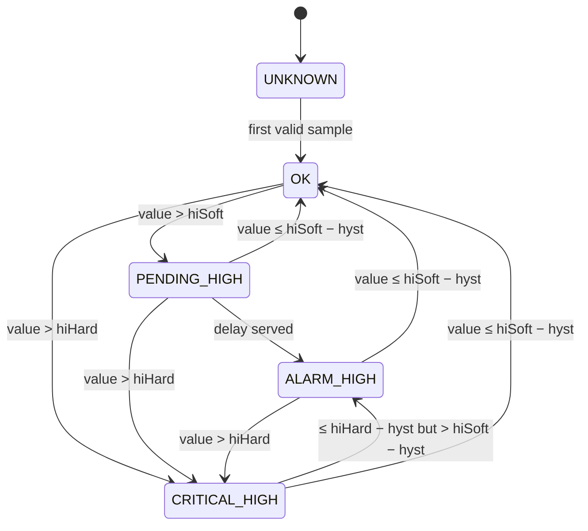

# RangeMonitor

Range monitor for one scalar measurement — temperature, humidity, pressure —
on ESP32, ESP8266 and AVR (Arduino).

A spike filter and a time-based EMA smooth the value. Soft limits raise an
alarm only after the value has stayed outside them for a configurable delay,
so expected, short excursions (a freezer's defrost cycle, an opened door) are
tolerated. Hard limits raise the alarm at once. Invalid samples turn into a
`FAULT` after their own delay. Every state change is reported to the caller,
which decides what to do about it: log, publish, send an SMS.

## Features

- **Two limit pairs.** Soft limits with an alarm delay, hard limits without
  one. Any limit may be left unset, so one-sided ranges (a server room that
  only needs an upper limit) need no dummy values.
- **Defaults that do the obvious thing.** An unset hard limit follows its soft
  limit, so a plain range behaves like a plain EMA + hysteresis alarm until
  you move a hard limit outward.
- **Spike filter.** Median of the last three samples ahead of the EMA: one
  bogus reading (85 °C from a DS18B20 that just reset) never reaches the
  alarm logic.
- **Time-based everything.** The EMA weight, both delays and the warm-up use
  the real time between samples, so irregular sampling is handled correctly.
- **Faults are an overlay.** A short sensor dropout during an alarm does not
  restart the alarm delay or produce a new alarm when the readings return.
- **Host-testable.** `update(value, nowMs)` takes the time as an argument; the
  whole state machine runs on a PC, and recorded data can be replayed to tune
  a configuration (`test/replay.cpp`).
- **Embedded-friendly.** No dynamic allocation, no strings held, C++11
  (compiles under the Arduino AVR core's `-std=gnu++11`). 88 bytes of RAM per
  instance on AVR. Thread-safe on ESP32 with a mutex in a static buffer.

## Processing chain

```text
raw ─► validity ─► [median of 3] ─► EMA ─┬─► hard limits: immediate
                                          └─► soft limits: after alarmDelaySeconds
```

Both limit pairs are checked against the same smoothed value.

## States

|State|Meaning|
|---|---|
|`UNKNOWN`|No valid sample yet|
|`OK`|Within range|
|`PENDING_HIGH` / `PENDING_LOW`|Outside a soft limit, alarm delay running|
|`ALARM_HIGH` / `ALARM_LOW`|Outside a soft limit for at least the delay|
|`CRITICAL_HIGH` / `CRITICAL_LOW`|Outside a hard limit|
|`FAULT`|Only invalid samples for at least `faultDelaySeconds`|

`isAlarm()` is true for `ALARM_*`, `CRITICAL_*` and `FAULT`. `PENDING_*` is
not an alarm: it is the excursion the delay exists to tolerate.



The lower side mirrors the upper one. `FAULT` can be entered from any state
and is left on the first valid sample (see [Faults](#faults)).

The rules behind the diagram:

- **Every exit uses the hysteresis**, including the exit from `PENDING`.
  Without it, a value hovering around a limit would restart the delay with
  every crossing and never raise an alarm.
- **From `CRITICAL` back to `ALARM`, not `PENDING`.** If the value falls below
  the hard limit but is still outside the soft one, the delay has already been
  served by the excursion itself.
- **Exactly on a limit is inside it.** The alarm needs `value > hiSoft`, the
  clear needs `value <= hiSoft - hysteresis`.

## Faults

Pass `NAN` (or ±infinity) to `update()` for a failed reading. After
`faultDelaySeconds` of nothing but invalid samples the state becomes `FAULT`.

`FAULT` interrupts the state machine rather than resetting it. When valid
samples return, evaluation resumes from the state the fault interrupted, and a
running alarm delay keeps its start time. A dropout during `ALARM_HIGH` thus
gives `ALARM_HIGH → FAULT → ALARM_HIGH`, not a second alarm after a fresh
delay.

An outage longer than the EMA warm-up time (3 × tau) makes the old value
stale: the filter is discarded and evaluation starts over when readings return.

## Usage

```cpp
#include <RangeMonitor.h>

RangeMonitor monitor;

void setup() {
    // Freezer: soft range -22..-15 °C, 1 °C hysteresis, 5-minute EMA.
    // A defrost may lift the air for up to ~35 minutes; above -5 °C is
    // never acceptable.
    RangeMonitor::Config cfg = RangeMonitor::Config::range(-22.0f, -15.0f, 1.0f, 300);
    cfg.hiHard            = -5.0f;
    cfg.alarmDelaySeconds = 45UL * 60UL;
    cfg.faultDelaySeconds = 60;
    monitor.reconfigure(cfg);
}

void loop() {
    RangeMonitor::Transition t = monitor.update(readTemperature());  // NAN on error
    if (t.changed()) {
        if (RangeMonitor::isAlarm(t.to) && !RangeMonitor::isAlarm(t.from)) {
            // alarm raised
        } else if (!RangeMonitor::isAlarm(t.to) && RangeMonitor::isAlarm(t.from)) {
            // alarm cleared
        }
    }
}
```

A server room that only needs upper limits:

```cpp
RangeMonitor::Config cfg;            // all limits unset
cfg.hiSoft            = 27.0f;       // warn after 10 minutes above 27 °C
cfg.hiHard            = 32.0f;       // alarm at once above 32 °C
cfg.hysteresis        = 1.0f;
cfg.tauSeconds        = 120;
cfg.alarmDelaySeconds = 600;
```

### Choosing the parameters

- **`tauSeconds`** — smoothing. The value follows a step to 63 % in one tau.
  It also delays the alarm by roughly the time the EMA needs to cross the
  limit, so keep it short compared with the alarm delay. 0 disables smoothing.
- **`alarmDelaySeconds`** — longer than the longest excursion that must be
  tolerated, measured on the *smoothed* value. Replay recorded data to find
  it (see below).
- **Hard limits** — beyond anything a normal excursion reaches. With the hard
  limit equal to the soft one (the default) the delay has no effect.
- **`hysteresis`** — larger than the noise left after smoothing. Must be less
  than half the soft range.

## Tuning with recorded data

`test/replay.cpp` feeds a CSV file (`seconds,value`) through the monitor and
prints every transition:

```sh
cd test
g++ -std=c++17 -Ithird_party replay.cpp -o build/replay
build/replay --lo -22 --hi -15 --hi-hard -5 --hyst 1 --tau 300 --delay 2700 freezer.csv
```

```text
  0d 00:00:00  raw   -18.00  ema   -18.00  unknown -> ok
  0d 03:06:50  raw   -11.17  ema   -14.95  ok -> pending_high
  0d 03:37:30  raw   -18.00  ema   -16.06  pending_high -> ok
  ...
8640 samples, 0 alarm(s)
```

The longest `pending_high` stretch is the excursion the delay has to cover.

## API

### Configuration

```cpp
struct RangeMonitor::Config {
    float    loSoft, hiSoft;      // NAN: no soft limit on that side
    float    loHard, hiHard;      // NAN: same as the soft limit (default)
    float    hysteresis;          // 0 by default
    uint32_t tauSeconds;          // 0: no smoothing
    uint32_t alarmDelaySeconds;   // 0: soft limits alarm at once
    uint32_t faultDelaySeconds;   // 0: the first invalid sample is a FAULT
    bool     spikeFilter;         // true by default

    static Config range(float lo, float hi, float hysteresis, uint32_t tauSeconds);
    static Config symmetric(float target, float delta, float hysteresis, uint32_t tauSeconds);
    float       effectiveHiHard() const;
    float       effectiveLoHard() const;
    ConfigError validate() const;
};
```

`validate()` checks, in order: no limit is infinite; `loSoft < hiSoft`; hard
limits are not inside the soft range; the effective hard limits do not cross;
the hysteresis is non-negative and `2 × hysteresis < hiSoft - loSoft`; the
time parameters fit the 32-bit millisecond clock.

### Monitor

|Method|Description|
|---|---|
|`RangeMonitor(const Config& = Config())`|An invalid config is replaced by one with no limits; see `configError()`|
|`Transition update(float raw, uint32_t nowMs)`|Feed a sample taken at `nowMs`|
|`Transition update(float raw)`|Same, at `millis()` (Arduino builds)|
|`Snapshot snapshot(uint32_t nowMs)` / `snapshot()`|State, smoothed and raw value, settled flag, sample count, time of the last change — one consistent copy|
|`State state()`|Current state|
|`float value()`|Smoothed value, `NAN` before the first valid sample|
|`bool isAlarming()`|`isAlarm(state())`|
|`ConfigError reconfigure(const Config&)`|Replace the limits; filter and state are kept, the new limits apply from the next sample|
|`bool getConfig(Config&)`|Copy the active configuration|
|`ConfigError configError()`|Validation result of the constructor's config|
|`bool reset()`|Back to `UNKNOWN` with an empty filter; config kept|

`Transition` holds `from` and `to`; `changed()` is `from != to`.

### Helpers

|Function|Description|
|---|---|
|`static bool isAlarm(State)`|`ALARM_*`, `CRITICAL_*`, `FAULT`|
|`static bool isHigh(State)` / `isLow(State)`|The `*_HIGH` / `*_LOW` states|
|`static char* stateName(State, char* buf, size_t len)`|Lower-case name (`"critical_high"`) into a caller buffer; `STATE_NAME_SIZE` always suffices. In flash on AVR|

The numeric values of `State` are stable and may be published or stored.

### Thread safety

On ESP32 every public method takes a FreeRTOS mutex created with
`xSemaphoreCreateMutexStatic()`, so the monitor can be fed from one task and
read from another without any heap use. The timeout is
`RANGE_MONITOR_MUTEX_TIMEOUT` (1000 ms). On timeout, queries return a neutral
value (`UNKNOWN`, `NAN`, `false`), `update()` returns an unchanged transition
and `reconfigure()` returns `LOCK_TIMEOUT`.

ESP8266 and AVR have no preemptive threads; the lock is a no-op there.

## Installation

### PlatformIO

```ini
lib_deps =
    soosp/RangeMonitor
```

[RunningStatistics](https://github.com/soosp/RunningStatistics) (for
`ExponentialAverage`) is installed with it.

### Arduino IDE

Search for **RangeMonitor** in the Library Manager. **RunningStatistics** is
offered as a dependency.

## Host tests

The state machine builds with a plain C++ compiler. Press `Ctrl+Shift+B` in
VS Code, or see [test/README.md](test/README.md).

## License

MIT — see [LICENSE](LICENSE).
